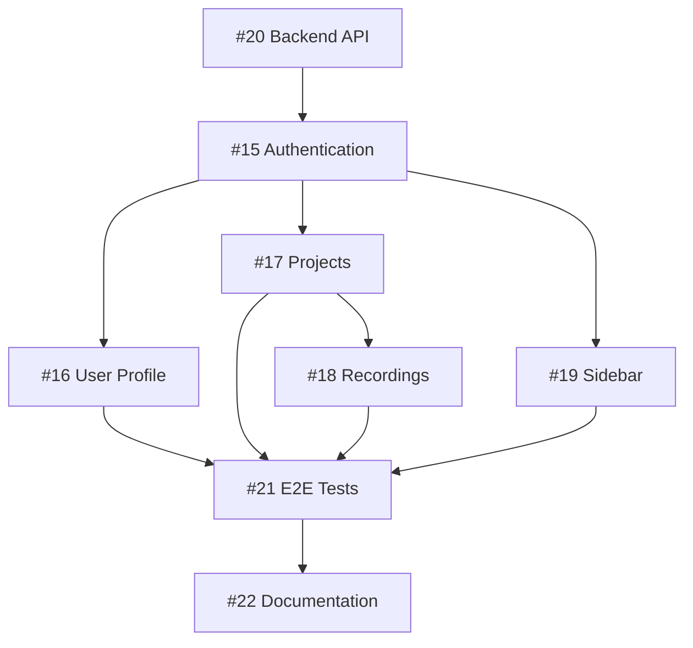

# Frontend 2.0 - Git Workflow & PR Process

## 🌳 Strategia Branching

### Główne branches
- `main` - produkcja
- `develop` - branch rozwojowy
- `feature/frontend-v2` - główny branch dla Frontend 2.0

### Feature branches
Każde issue (#15-#22) ma swój dedykowany branch:

## 📋 Branches dla każdego Issue

### Issue #15: 🔐 Authentication System
```bash
git checkout -b feature/frontend-v2-auth
```
**PR Title**: `feat(auth): TDD implementation of authentication system #15`

### Issue #16: 👤 User Profile Management
```bash
git checkout -b feature/frontend-v2-user-profile
```
**PR Title**: `feat(user): TDD user profile management #16`

### Issue #17: 📁 Project Management System
```bash
git checkout -b feature/frontend-v2-projects
```
**PR Title**: `feat(projects): TDD project management with tags #17`

### Issue #18: 🎤 Recording Management
```bash
git checkout -b feature/frontend-v2-recordings
```
**PR Title**: `feat(recordings): TDD recording management in projects #18`

### Issue #19: 🎨 Sidebar Navigation
```bash
git checkout -b feature/frontend-v2-sidebar
```
**PR Title**: `feat(layout): TDD sidebar navigation and layout #19`

### Issue #20: 🔌 Backend API
```bash
git checkout -b feature/frontend-v2-api
```
**PR Title**: `feat(api): Backend API endpoints for frontend v2 #20`

### Issue #21: 🧪 E2E Tests
```bash
git checkout -b feature/frontend-v2-e2e
```
**PR Title**: `test(e2e): Complete user journey tests #21`

### Issue #22: 📚 Documentation
```bash
git checkout -b feature/frontend-v2-docs
```
**PR Title**: `docs: Frontend v2 architecture documentation #22`

## 🔄 Workflow dla każdego Feature

### 1. Rozpoczęcie pracy
```bash
# Upewnij się, że masz najnowszy kod
git checkout develop
git pull origin develop

# Utwórz nowy branch dla feature
git checkout -b feature/frontend-v2-[nazwa]

# Przykład dla autentykacji
git checkout -b feature/frontend-v2-auth
```

### 2. Rozwój z TDD
```bash
# 1. Najpierw napisz testy
npm test -- --watch

# 2. Commit testów
git add src/tests/auth/*.test.tsx
git commit -m "test(auth): add authentication component tests"

# 3. Implementacja (RED -> GREEN -> REFACTOR)
git add src/components/auth/*
git commit -m "feat(auth): implement login form component"

# 4. Refactoring
git add .
git commit -m "refactor(auth): improve error handling"
```

### 3. Przygotowanie do PR
```bash
# Upewnij się, że wszystkie testy przechodzą
npm test
npm run lint
npm run typecheck

# Zaktualizuj branch z develop
git checkout develop
git pull origin develop
git checkout feature/frontend-v2-auth
git rebase develop

# Push branch
git push origin feature/frontend-v2-auth
```

### 4. Tworzenie Pull Request

#### PR Template
```markdown
## 📋 Description
Closes #[issue_number]

Brief description of changes implemented.

## 🧪 Tests
- [ ] All unit tests pass
- [ ] New tests added for new functionality
- [ ] Test coverage maintained/improved

## ✅ Checklist
- [ ] Tests written BEFORE implementation (TDD)
- [ ] Code follows project conventions
- [ ] No linting errors
- [ ] No TypeScript errors
- [ ] Documentation updated
- [ ] Responsive design verified
- [ ] Accessibility checked

## 📸 Screenshots (if UI changes)
[Add screenshots here]

## 🔗 Related Issues
- Closes #[issue_number]
- Related to Frontend 2.0 milestone

## 📝 Testing Instructions
1. Step to test feature
2. Expected behavior
3. Edge cases to verify
```

### 5. Code Review Process

#### Reviewer Checklist
- [ ] Tests are comprehensive
- [ ] TDD approach was followed
- [ ] Code is maintainable
- [ ] No security issues
- [ ] Performance considerations addressed
- [ ] Follows project patterns

### 6. Merge Strategy
```bash
# Po zatwierdzeniu PR
# Używamy squash merge dla czystej historii
git checkout develop
git pull origin develop
git merge --squash feature/frontend-v2-auth
git commit -m "feat(auth): complete authentication system (#15)"
git push origin develop
```

## 📊 PR Dependencies & Order



### Recommended PR Order:
1. **Phase 1**: Backend API (#20) - podstawa dla frontendu
2. **Phase 2**: Authentication (#15) - wymagane dla wszystkiego
3. **Phase 3**: Parallel development
   - User Profile (#16)
   - Projects (#17)
   - Sidebar (#19)
4. **Phase 4**: Recordings (#18) - wymaga projektów
5. **Phase 5**: E2E Tests (#21) - po wszystkich features
6. **Phase 6**: Documentation (#22) - finalizacja

## 🚀 GitHub Actions CI/CD

### `.github/workflows/frontend-v2-pr.yml`
```yaml
name: Frontend v2 PR Checks

on:
  pull_request:
    branches: [develop, main]
    paths:
      - 'src/**'
      - 'tests/**'
      - 'package.json'

jobs:
  test:
    runs-on: ubuntu-latest
    
    steps:
    - uses: actions/checkout@v3
    
    - name: Setup Node.js
      uses: actions/setup-node@v3
      with:
        node-version: '18'
        cache: 'npm'
    
    - name: Install dependencies
      run: npm ci
    
    - name: Run linting
      run: npm run lint
    
    - name: Run type checking
      run: npm run typecheck
    
    - name: Run tests with coverage
      run: npm test -- --coverage --watchAll=false
    
    - name: Upload coverage
      uses: codecov/codecov-action@v3
      with:
        file: ./coverage/lcov.info
    
    - name: Build application
      run: npm run build
    
    - name: Comment PR
      uses: actions/github-script@v6
      if: github.event_name == 'pull_request'
      with:
        script: |
          const coverage = require('./coverage/coverage-summary.json');
          const total = coverage.total;
          
          const comment = `## 📊 Test Coverage
          - Statements: ${total.statements.pct}%
          - Branches: ${total.branches.pct}%
          - Functions: ${total.functions.pct}%
          - Lines: ${total.lines.pct}%`;
          
          github.rest.issues.createComment({
            issue_number: context.issue.number,
            owner: context.repo.owner,
            repo: context.repo.repo,
            body: comment
          });
```

## 🏷️ Git Commit Convention

### Format
```
<type>(<scope>): <subject>

<body>

<footer>
```

### Types
- `feat`: New feature
- `fix`: Bug fix
- `test`: Adding tests
- `refactor`: Code refactoring
- `docs`: Documentation
- `style`: Code style changes
- `perf`: Performance improvements
- `chore`: Maintenance tasks

### Examples
```bash
# Testy
git commit -m "test(auth): add login form validation tests"

# Feature
git commit -m "feat(auth): implement JWT token management"

# Fix
git commit -m "fix(auth): resolve token refresh race condition"

# Refactor
git commit -m "refactor(auth): extract validation logic to utils"
```

## 📝 Branch Protection Rules

### For `develop` branch:
- ✅ Require pull request reviews (min 1)
- ✅ Dismiss stale PR approvals
- ✅ Require status checks to pass
  - Tests must pass
  - Linting must pass
  - Build must succeed
- ✅ Require branches to be up to date
- ✅ Include administrators
- ✅ Restrict who can push

## 🔍 PR Review Guidelines

### What to look for:
1. **TDD Compliance**
   - Tests written first
   - Tests are meaningful
   - Good test coverage

2. **Code Quality**
   - Clean, readable code
   - Follows project patterns
   - No code smells

3. **Security**
   - No hardcoded secrets
   - Proper validation
   - XSS prevention

4. **Performance**
   - No unnecessary re-renders
   - Optimized queries
   - Lazy loading where appropriate

5. **Accessibility**
   - ARIA labels
   - Keyboard navigation
   - Screen reader support

## 🎯 Definition of Ready (DoR)

Before starting work on a branch:
- [ ] Issue is clearly defined
- [ ] Acceptance criteria are set
- [ ] Dependencies identified
- [ ] Test scenarios defined
- [ ] Design/mockups available (if UI)

## ✅ Definition of Done (DoD)

Before creating PR:
- [ ] All acceptance criteria met
- [ ] Unit tests written and passing
- [ ] Integration tests (if applicable)
- [ ] Code reviewed locally
- [ ] Documentation updated
- [ ] No console errors/warnings
- [ ] Responsive design verified
- [ ] Accessibility checked
- [ ] Performance acceptable

## 📅 Sprint Planning

### Sprint 1 (Week 1-2)
- [ ] PR #20: Backend API
- [ ] PR #15: Authentication

### Sprint 2 (Week 3-4)
- [ ] PR #16: User Profile
- [ ] PR #17: Projects
- [ ] PR #19: Sidebar

### Sprint 3 (Week 5-6)
- [ ] PR #18: Recordings
- [ ] PR #21: E2E Tests

### Sprint 4 (Week 7-8)
- [ ] PR #22: Documentation
- [ ] Final integration
- [ ] Deployment preparation

## 🚨 Hotfix Process

For critical fixes:
```bash
# Create hotfix from main
git checkout main
git checkout -b hotfix/critical-auth-fix

# Fix and test
# ...

# Create PR directly to main AND develop
# After merge, tag release
git tag -a v2.0.1 -m "Hotfix: Authentication critical fix"
git push origin v2.0.1
```

## 📊 Metrics to Track

- PR cycle time (creation to merge)
- Number of review iterations
- Test coverage percentage
- Build success rate
- Average PR size (lines of code)

## 🔗 Useful Commands

```bash
# Check branch status
git branch -a

# Clean up local branches
git branch -d feature/frontend-v2-auth

# See PR-ready branches
git log develop..feature/frontend-v2-auth --oneline

# Interactive rebase for clean history
git rebase -i develop

# Check what will be in PR
git diff develop...feature/frontend-v2-auth
```